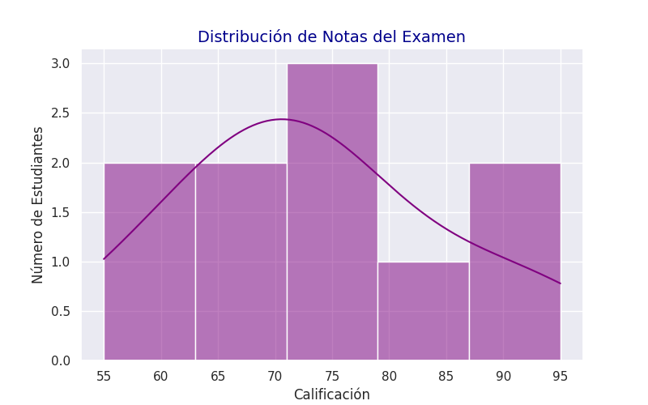

# 📊 Análisis de Datos Académicos

Este repositorio contiene herramientas en Python para procesar notas y generar reportes automáticos.

## 📈 Resultados

## 🛠️ Tecnologías
- **Python 3.12**
- **Bibliotecas:** Pandas, Seaborn, Matplotlib.